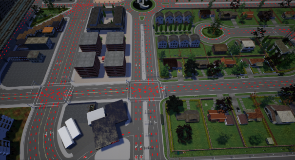
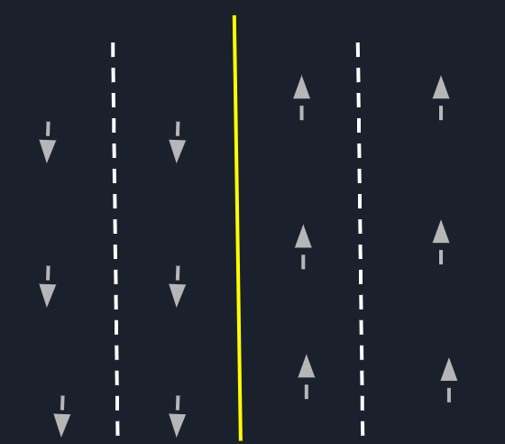
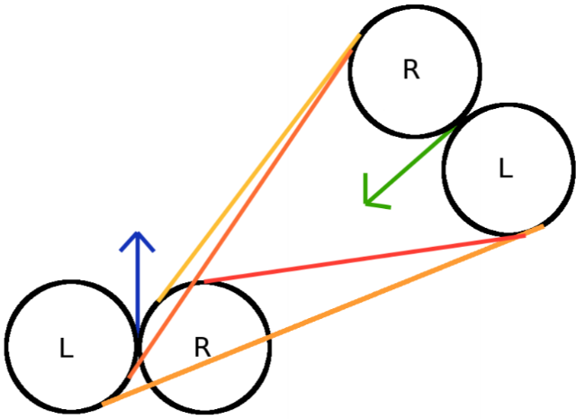
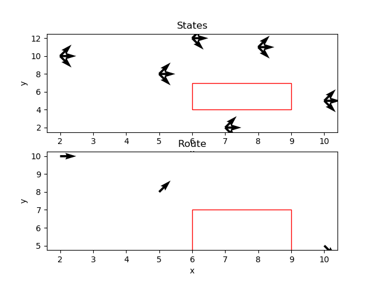
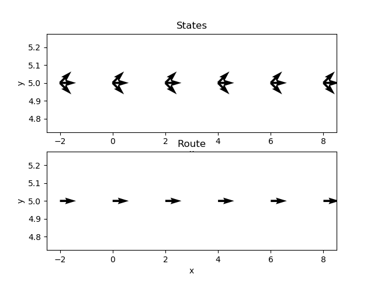
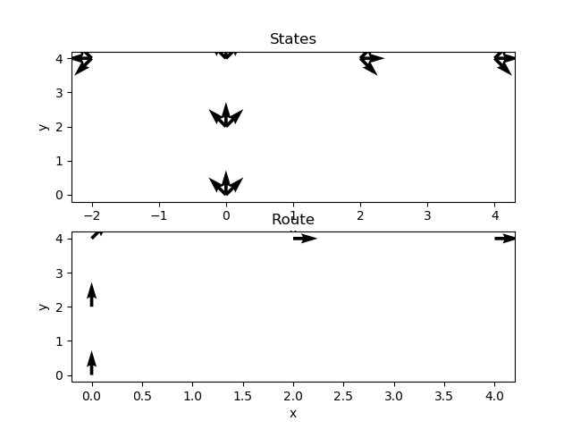

Robot-Parallel-Motion-Planning
======================

**University of Pennsylvania, CIS 565: GPU Programming and Architecture, Final Project**

* Peyman Norouzi: [LinkedIn](https://www.linkedin.com/in/peymannorouzi)

* Klayton Wittler: [LinkedIn](https://www.linkedin.com/in/klayton-wittler)

Industrial road | Running from the cops 
:-------------------------:|:-------------------------:
| 

## Milestones:

* [Pitch](files/CIS565_finalProject-pitch.pdf)
* [Milestone 1](files/CIS565_RPMP-milestone1.pdf)
* [Milestone 2](files/CIS565_RPMP-milestone2.pdf)
* [Milestone 3](files/CIS565_RPMP-milestone3.pdf)

# Pipeline

# State Space Samples

CARALA state samples | Up sample orientation 
:-------------------------:|:-------------------------:
| 

# Dubin's Model

Dubin's Model | Example 
:-------------------------:|:-------------------------:
| 

# GMT* Sampling Based Motion Planning

# Debugging

Unit Test 1 | Unit Test 2 | Unit Test 3 
:-------------------------:|:-------------------------:|:-------------------------:
| |  
