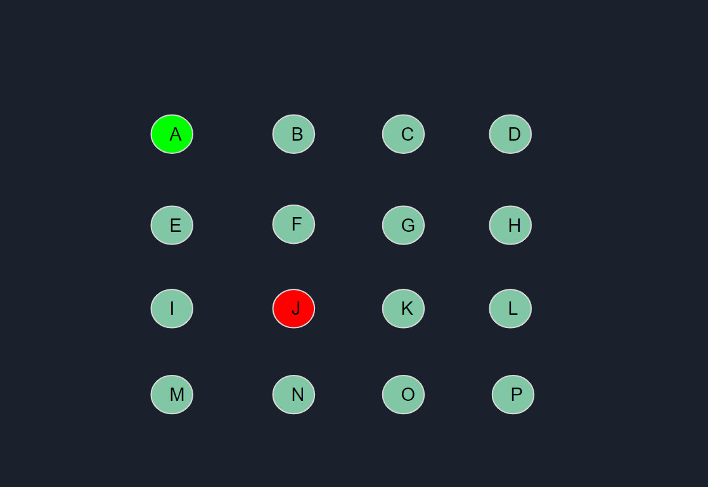
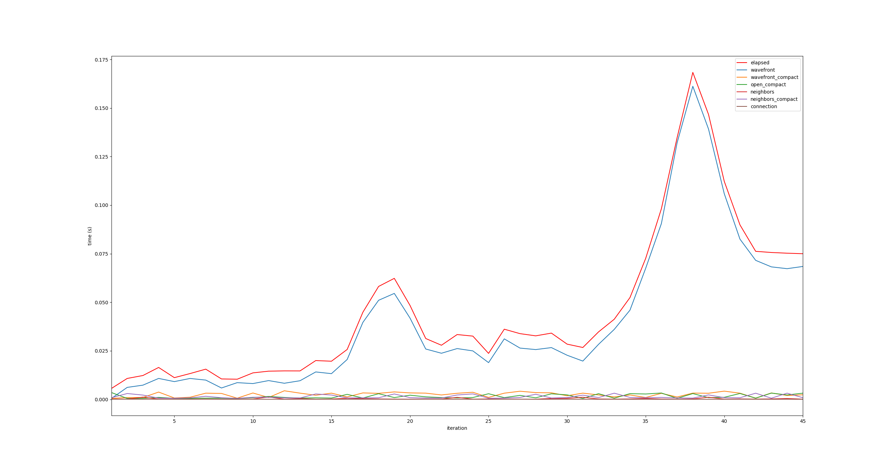
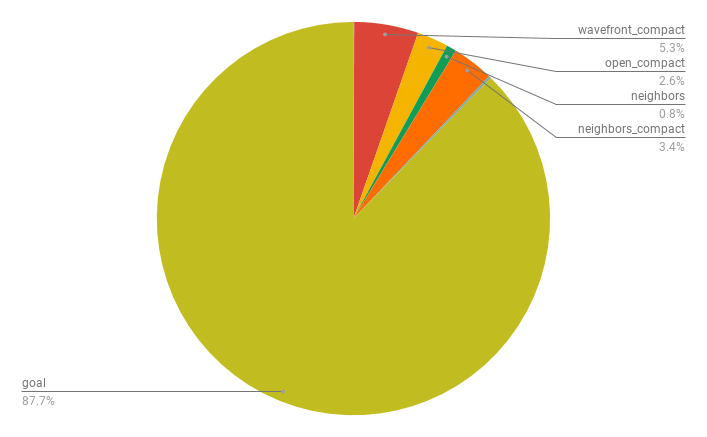
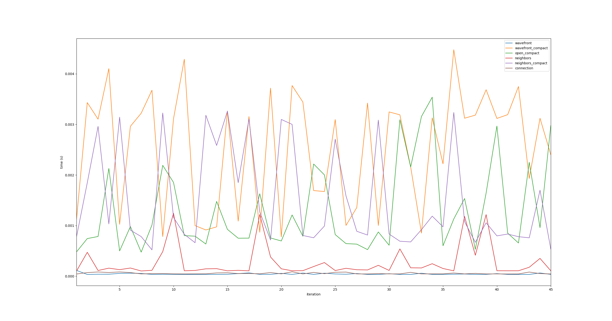
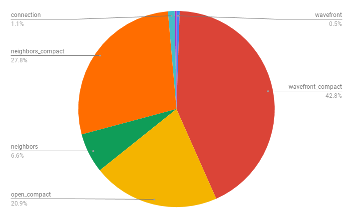
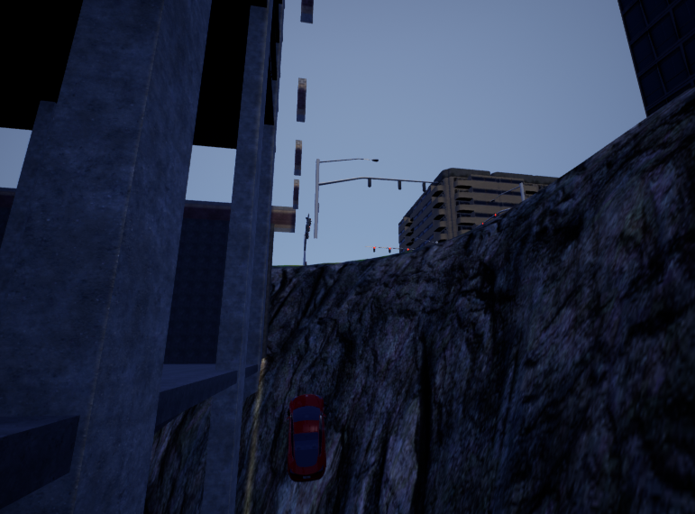
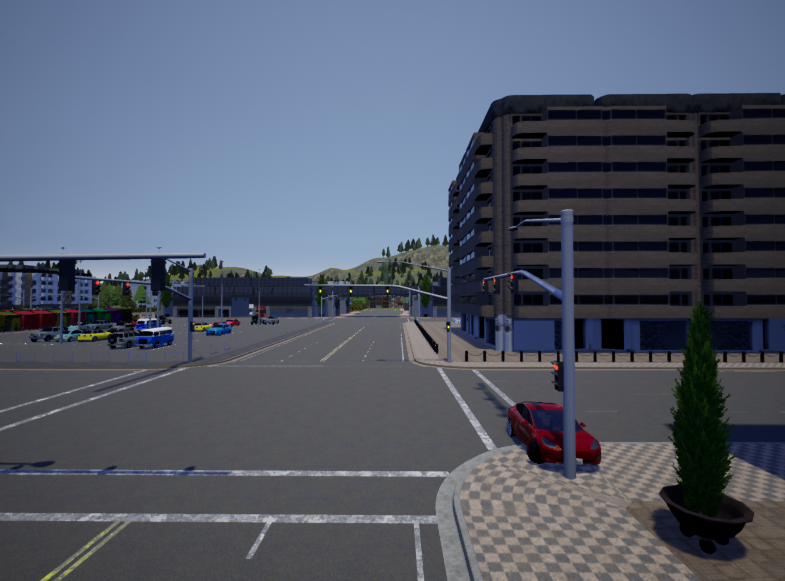

Robot Parallel Motion Planning
======================

**University of Pennsylvania, CIS 565: GPU Programming and Architecture, Final Project**

* Peyman Norouzi: [LinkedIn](https://www.linkedin.com/in/peymannorouzi)

* Klayton Wittler: [LinkedIn](https://www.linkedin.com/in/klayton-wittler), [Website](https://klaywittler.github.io/)
    * Tested on: Windows 10 Pro, i7-7700K @ 4.20GHz 16.0GB, GTX 1070 8.192GB

Industrial road | Running from the cops 
:-------------------------:|:-------------------------:
| 

## Table of Content:

- [Overview](#overview)
  * [Parrallel Motion Planning on the GPU](#parrallel-motion-planning-on-the-gpu)
  * [CARLA](#carla)
  * [Build](#build)
  * [Results](#results)
- [GMT* Algorithm](#gmt-algorithm)
  * [Sampling Based Motion Planning](#sampling-based-motion-planning)
- [Implementation](#implementation)
  * [Enviroments](#enviroments)
  * [Pipeline](#pipeline)
  * [State Space Samples](#state-space-samples)
  * [Dubin's Cost Model](#dubins-cost-model)
  * [Collision Check](#collision-check)
  * [Debugging/Unit Testing](#debuggingunit-testing)
- [Performance Analysis](#performance-analysis-)
  * [Optimization and Future work](#optimization-and-future-work)
  * [Bloopers](#bloopers)
- [Milestones](#milestones)
- [Credits/Sources](#creditssources)


## Overview:

Autonomous vehicles are a new sensation of the 21st-century economy. Many big/small companies are fiercely competing in their path of full driving autonomy. The goal of this project is to make use of the parallelization power of the GPU to create an autonomous robot (vehicle) capable of reaching a defined goal while navigating in an unknown enviroment.

An autonomous vehicle needs to be able to do the following 4: 

**1. Identify:**

An autonomous vehicle needs to be able to comprehend its surroundings and identify objects that may affect its decision making. Identification is usually done using the car's perception/vision system. The perception system usually consists of a combination of RGB cameras, Lidar and Radar.

**2. Predict:**

Now that the vehicle knows about objects surrounding it, it needs to predict surroundings behavior over a short and long time so the vehicle can appropriately behave in various scenarios. For example, If a car is moving on the lane next to it is moving at 30 MPH, the vehicle should be able to predict what the car is going to do in the next 5 seconds. 

**3. Decide:**

With the current knowledge of the surroundings and the desired destination, the car then needs to decide on how to move (motion planning) to reach the desired goal safely and efficiently.


**4. Execute:**

When a decision is made by the car's computer system, the car needs to be able to appropriately execute the plan in the environment that it is in using its engine wheel and transmission system


This project is mainly focused on number **3. Decide**. We implemented GMT* motion planning algorithm on the GPU and tested its effectiveness in various unknown environments in CARLA car simulator.

### Parrallel Motion Planning on the GPU:

Motion planning algorithms are meant to help an autonomous robot to find a sequence of valid configurations that moves it from the source to the desired destination. Due to the sequential nature of the task, many different sequential algorithms can successfully achieve this in various scenarios. One example of such an algorithm is [FMT*(Fast Marching Tree)](https://arxiv.org/pdf/1306.3532.pdf). Although FMT* works great for high dimensional state space, due to its sequential nature it is not able to be run on the GPU. For the algorithm to be able to be run on the GPU, we need to alter the algorithm to be able to run in parallel at some abstract level. This where [GMT* (Group Marching Tree)](https://arxiv.org/abs/1705.02403) paper comes into play. Brian Itcher et al proposed a variation to the FMT* that would allow it to run on the GPU. We implemented the algorithm on the GPU and tested our result on CARLA driving simulator. We will discuss the algorithm in more detail later in the read me!

### CARLA:

Our testing environment for this project is [CARLA driving simulator](http://carla.org/), which is an open-source development, training, and validation environment for autonomous driving systems. CARLA is built on top of UE4 and has a python client API that allows us to engage with a car and driving environment. We decided to go with CARLA due to time and financial resources (check our bloopers :D) that an actual robot would have taken from us to complete this project.

### Build:

To be able to run our code you need the following dependencies:

**Dependencies:**

* Python 3.7 (install Anaconda if you are new to python)
* Anaconda
* CARLA 0.9.5 (Tested on Windows Version)
* PyCuda 2019.1.2
* NumPy
* pygame 1.9.6
* Pandas
* opencv-python
* networkx
* timeit


To **run our code** follow the following instructions (These instructions are for windows):

1. Download and unzip the compiled version of CARLA 0.9.5 from [Here](https://github.com/carla-simulator/carla/releases)

2. Make sure all of the dependencies mentioned above are installed

3. Go to where you unzipped CARLA and run the following command in windows cmd (This initializes CARLA server that you can then connect to using python):

  ```
  CarlaUE4.exe -carla-server -benchmark -fps=15 -windowed -ResX=800 -ResY=600  
  ```
  
4. Clone this repository into your desired path

6. Start Anaconda Prompt and go to "carla" folder in your cloned repository

7. Run the following command in Anaconda Prompt

  ```
  py -3.7 run.py
  ```

A ```game_loop(options_dict)``` function has been defined which can be called from another python script if you'd like. The parameters it currently takes are:

* sync (boolean): enable serve-client sync with 0.05s fixed time step
* debug (boolean): to print main calculation in each step
* record (boolean): save run as a .avi file
* time (boolean): to perform performance analys
* num_obstacles (int): spawn X number of obstacle randomly
* spawn_point_indices (list of ints): list of indices which correspond to indicies in the spawn point list from the CARLA map. 0th index start and all following will be the goals in order.
* agent (string): currently support 3 agent 'basic' is CARLA's implementation, 'test' executes our GMT planner on the first iteration and follows that path, 'cuda' executes GMT every time step

### Results:

Here you can see some of our results in various scenarios: (In some cases we added to the logic to wait for the red light and in some cases we allowed the car to not care about the red light on purpose)

<p align="center">
  
</p>

<p align="center">
  
</p>

<p align="center">
  
</p>

<p align="center">
  
</p>

<p align="center">
  
</p>


## GMT* Algorithm:

### Sampling Based Motion Planning:

GMT* works by taking sampled states and performing approximate [dynamic programming](https://en.wikipedia.org/wiki/Dynamic_programming) to grow a tree of near-optimal paths. 

To perform this algorithm we maintain 6 buffers: open set, wavefront set, unexplored set, unexplored neighbor set, accumulated cost, and parent. 
The open set is every node that is a leaf in the tree, the wavefront set are the nodes that are in the open set and the accumulated cost is below a threshold in which we will expand those nodes. For every node in the wavefront, the neighbors that have not been explored are added to the unexplored neighbor set which will be evaluated to add to the tree. The unexplored set marks which nodes have not been seen. The accumulated cost set tracks the cost to travel to a certain node all initialized to infinity and the parent buffer tracks the structure of the tree which is initialized to -1. In the first iteration, the start node is added to the open set, closed from the unexplored set, and the cost set to 0.

In each iteration the neighbors of every node in the wavefront are added to the unexplored neighbor set if it has not been seen. The unexplored neighbor set is then connected to the nodes in the open set where the most locally optimal connection is kept and indicated in the parent buffer and the accumulated cost of the unexplored neighbor updated to be the parent node plus the cost of connection. The nodes are taken off the unexplored neighbor set and added to the open set. This is repeated until the goal ends up in the wavefront.
 



## Implementation:

In this section we go through our implementation that allows our virtual [Tesla Model 3](https://twitter.com/elonmusk?ref_src=twsrc%5Egoogle%7Ctwcamp%5Eserp%7Ctwgr%5Eauthor) drive around the city so smoothly!

### Enviroments:

There are 3 different subsystems/environments that work with each other enabling our autonomous car to perform its tasks. CARLA, as the simulator, gives us the actual environment, obstacles, physics rules, etc. [PyCuda](https://documen.tician.de/pycuda/) (that is a Cuda wrapper for Python), on the other hand, deals with all the operations that need to be done in the GPU. Python is the binding environment between CARLA and PyCuda. Python gets environment information from CARLA and transfers it appropriately to PyCuda for GPU operations. After Path calculation on the GPU, python transfers the path to CARLA to be executed in the environment. You can see the three systems' interactions in the figure below:

<p align="center">
  
</p>

### Pipeline:

<p align="center">
  
</p>

You can see the overall pipeline of our code implementation. This pipeline is a generic pipeline for many self-driving robotic applications. We implemented the whole pipeline using the three environments explained above. The red rectangle indicates the main part of our implementation in which we created from the ground up using the three environments (This is where we implement GMT* on the GPU). The rest of the pipeline was implemented so that we have the proper follow of information but we used CARLA for gathering the required information. The information was gathered in a way though to simulate an actual flow of information in a real self-driving environment. For example, in the sensors section, we did not create our sensor configuration but rather used the simulator (CARLA) for the gathering of important obstacle information (such as their location in the map). The information was aquired in a way to simulate the location of the obstacles only when we get to 30 meters approximately of them (just like how real sensor configuration would behave). 


### State Space Samples:

Discretizing space is required when you are trying to plan your motion in a continuous space. We defined our state space to be in the following format:

<p align="center">
  
</p>

Where X and Y are the locations with respect to CARLA's world coordinate system and θ is the yaw angle of the car (Car's orientation with respect to Z (height)). We queried all of the possible location states from CARLA that lie in the streets where the car can move. The left image in the figure below shows the states that CARLA gives us. We designed state space points(waypoints) to be at least 4 meters apart since 4 gave us a good balance between performance and precision. Since CARLA only offers orientations that correspond with the flow of traffic on the corresponding side of the road, we had to add more 6 more directions for each given X and Y combination so that we would be able to deal with obstacles we face during our motion. We made sure not to have orientation opposite to the flow of traffic on each respective side of the road, making sure that after each maneuver around obstacles, our car doesn't continue driving on the wrong side of the road. You can see our final set up our state-space on the right animation in the figure below. 


CARALA state samples | Up sample orientation 
:-------------------------:|:-------------------------:
| 

### Dubin's Cost Model:

Now that we have our state-space discretized, we need to figure out a way to evaluate how costly it is to move between each of the states. This way when we are planning our motion between states, we can know costly each connection between states is going to be. This would allow us to choose the least costly path between our source and destination. A 4-wheel vehicle is a non-holonomic robot meaning that the car has constraints that are nonintegrable into positional constraints. A good easy to implement model of motion for our vehicle is Dubin's path. If we assume our vehicle to be a Dubin's car, we can easily find the shortest path between two states using only 3 controls: “turn left at maximum”, “turn right at maximum”, and “go straight”. The Dubin’s Car was introduced into the literature by Lester Dubins, a famous mathematician and statistician, in a paper published in 1957. Let’s name the controls: “turn right at maximum” will be R, “turn left at maximum” will be L, and “go straight” will be S. Then Dubins showed in his paper that the shortest path between two states is going to be one of the following paths: LSL, LSR, RSL, RSR, RLR, and LRL. We can find the cost between two states by finding the shortest length of travel out of the 6 offered paths. If you would like to know more about the topic check this [link out](https://gieseanw.files.wordpress.com/2012/10/dubins.pdf). Below you can see, 4 out of 6 (LSL, LSR, RSL, RSR) Dubin's path options (taken from [here](https://gieseanw.files.wordpress.com/2012/10/dubins.pdf)):

<p align="center">
  
</p>


### Collision Check:

Using Dubins'paths to find the shortest path between two states would not be enough for our algorithm as it was intended. We need to be able to identify if any of the paths between two states collide with objects that lie in between them. We implemented a method that checks if any of the paths between two states collide with objects in our near surroundings (30 meters). If the path collides with any obstacle, we consider the path as invalid (we loop through the obstacles that are close to us in the GPU). After removing invalid paths we can find the lowest cost between two states by taking the shortest Dubins path between the remaining valid paths. The figure below shows the procedure in action (red box is the obstacle): 

<p align="center">
  
</p>


### Debugging/Unit Testing:

Since we are dealing with three environments for the completion of this project, there can be many opportunities in which our simulation might fail! But we knew simulation failure didn't necessarily mean that our Implementation of the GMT* algorithm is wrong! We also knew that it would be really hard to test for every test/edge cases using the full CARLA simulation, thus we had to come up with some clever Unit test so that we can check our GPU implementation frequently and efficiently! These tests saved us many many hours of unnecessary grief while debugging our code! You can see the three Unit tests all below (red box represent an obstacle): (top image is the state space and the bottom picture is the correct output path that our algorithm found)


Unit Test 1 | Unit Test 2 | Unit Test 3 
:-------------------------:|:-------------------------:|:-------------------------:
| |  

## Performance Analysis:


<p align="center">
  
</p>


In the plot above, the blue top line shows the total elapsed time per iteration and right below it is the kernel to check if the goal has been found which is consuming  1.89s total, almost 90% of the current 2.16s run time seen below in the pie chart.

<p align="center">
  
</p>


To see some of the performance of the other kernels the plot below exludes the goal kernel time, which all in total accounts for 0.25s of run time. If the goal kernel can be speed up to match at worst times of 4ms we could achieve a run time of about 0.3s which is not at control frequency run time but still very fast in a very big state space of over 50,000 states

<p align="center">
  
</p>

From the pie chart below it can be seen that most of the time is spent compacting arrays in order to launch more efficient kernels that do some of the planning computation. There is most likely some more room for improvement in structuring this problem to reduce compaction time. Streams were tried and found to have marginal effect, most likely to do the wash out of the goal kernel.

<p align="center">
  
</p>


### Optimization and Future work:

Moving forward a clever approach to checking if the goal has been found needs to be tackled so that the algorithm can run online and be used for real time planning. To achieve the desired 100 Hz control frequency, the compaction operations also need to be reduced. Further, CPU multi-threading can be used to control the GPU planning while other threads manage other parts of the code. 

Also to make the autonomous vehicle complete perception and state estimation need to be implemented to avoid obstacles and come off of the imformation queried from CARLA. Most of the foundation work for this was completed, but not fully implemented as the focus was to complete a parallel motion planning algorithm. Furthermore, to be used in real life prediction will be needed to estimate the states of other agents in the environment and help for planning around the other agents. Lastly, a default PID control from CARLA was used to control throttle and steering angle to get to the waypoints the planner returned. There are several approaches to improve the controller, one is to tune the current PID better as it definitely has some room for improvent, retrieve the inputs from the Dubin's path, or implement an advanced optimization based controller.

### Bloopers:

Here are some bloopers showing that anyone can and will make mistakes along the way lol :)

  

  

## Milestones:

* [Pitch](files/CIS565_finalProject-pitch.pdf)
* [Milestone 1](files/CIS565_RPMP-milestone1.pdf)
* [Milestone 2](files/CIS565_RPMP-milestone2.pdf)
* [Milestone 3](files/CIS565_RPMP-milestone3.pdf)

## Credits/Sources:

* [FMT*](https://arxiv.org/pdf/1306.3532.pdf)
* [GMT*](https://arxiv.org/abs/1705.02403)
* [CARLA](http://carla.org/)
* [PyCuda](https://documen.tician.de/pycuda/)
* [DUBINS](https://gieseanw.files.wordpress.com/2012/10/dubins.pdf)


